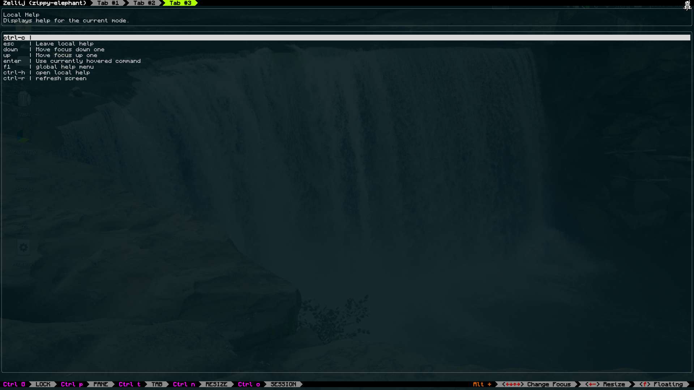

# local-help.xplr
An [xplr](https://github.com/sayanarijit/xplr) plugin that adds a local help screen under `ctrl-h`.

See [xplr documentation](https://xplr.dev/en/) for instructions on how to use xplr plugins.

The plugin takes 2 parameters:

- `key` (default `ctrl-h`): Determines the key to open local help with.

- `input_buffer_height` (default 3): Determines the space around the input buffer.  If you haven't messed with layout, don't touch this

# Why:

The help tile in `xplr` is small, doesn't show everything, and is a bit lacking. The global help shows everything, including what is irrelevant to your current situation, and can be hard to navigate.

# Usage:

Press your chosen help key in any screen to open up a menu that shows keybinds and their description, as well as the name and description (if any) of the previous mode.
Type to filter, and press up and down to highlight different ones.  If you want to return, press `esc` and if you want to use a highlighted keybind, press `enter`.



If you're confused about what to do or what you can do in this screen, local help the local help!

# Installation:

I recommend using the [xpm](https://github.com/dtomvan/xpm.xplr) plugin manager, or some other plugin manager.

You can either use the defaults:
```lua
require("xpm").setup({
	...
	'LyxHuston/local-help.xplr'
	...
})
```

Or customize it:
```lua
require("xpm").setup({
	...
	{
		name = 'LyxHuston/local-help.xplr',
		setup = {
			key = "?",
			input-buffer-size = "4"
		}
	}
	...
})
```


To use it manually:

* Clone the plugin:

```bash
mkdir -p ~/.config/xplr/plugins

git clone https://github.com/LyxHuston/local-help.xplr ~/.config/xplr/plugins/local-help
```

* Add the following lines in `~/.config/xplr/init.lua`:

```lua
local home = os.getenv("HOME")
package.path = home
.. "/.config/xplr/plugins/?/init.lua;"
.. home
.. "/.config/xplr/plugins/?.lua;"
.. package.path

require("local-help").setup()
-- or
require("local-help").setup({
	key = "?",
	input_buffer_height = 4
})
```

... And that's it!  Press `ctrl-h` (or your chosen key) in any mode to access local help.

### Limitations

* Almost by design this plugin does not help with any generic keybinds, such as a keybind that triggers on any function key.
* It will not show the full description of a mode if it is very long.
